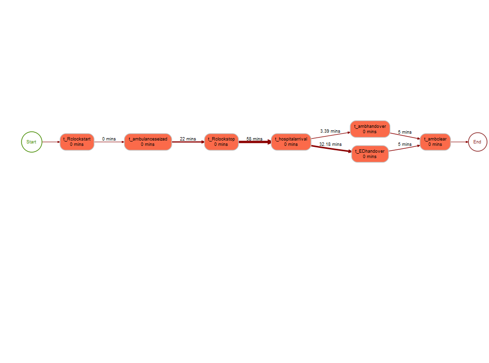
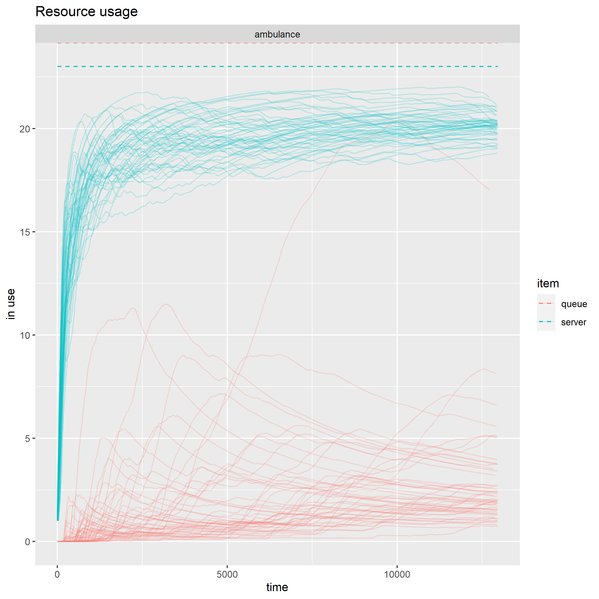
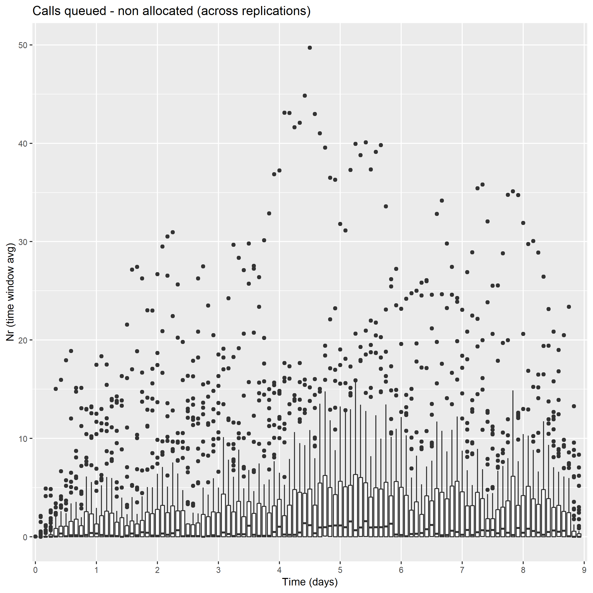
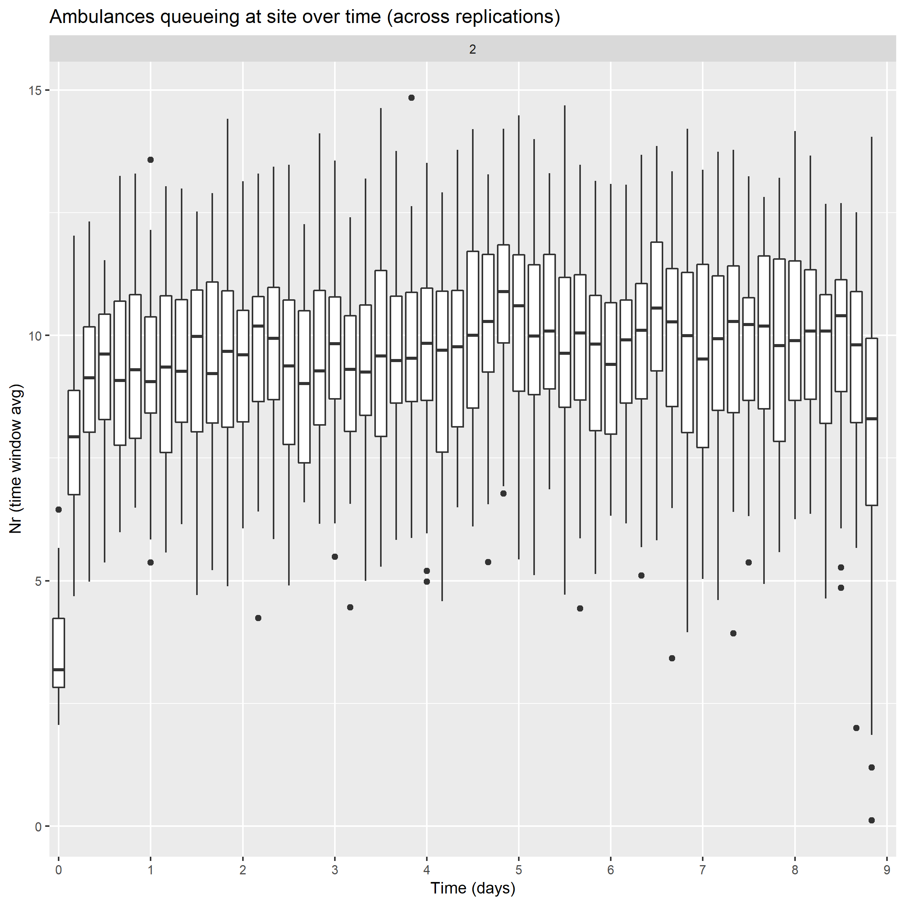
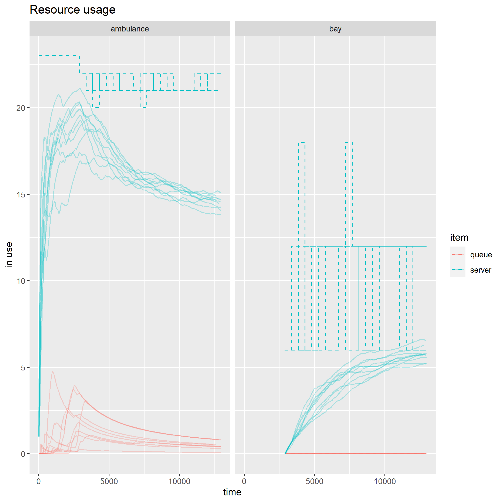
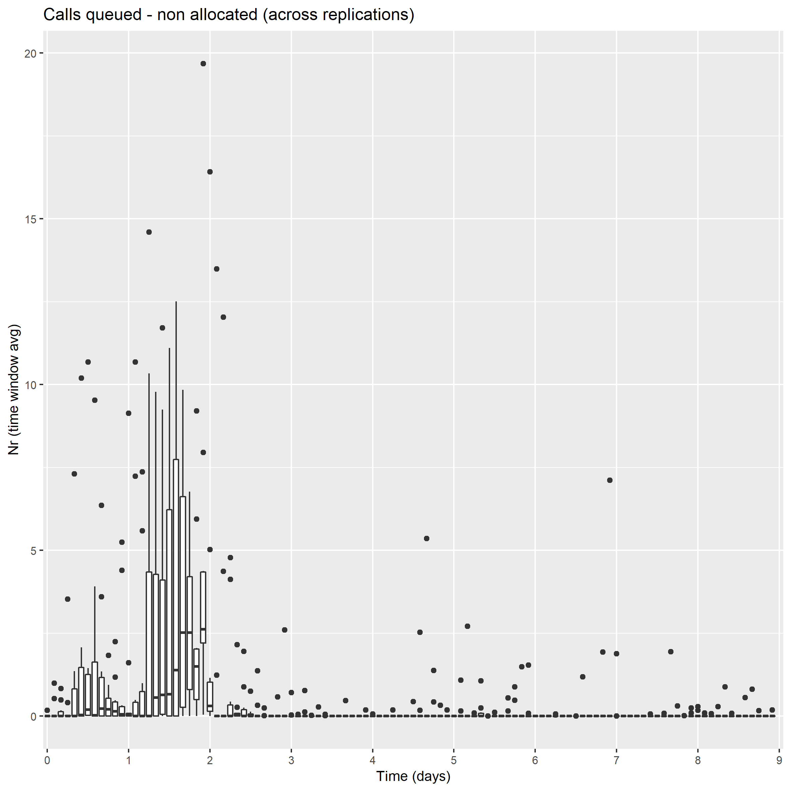
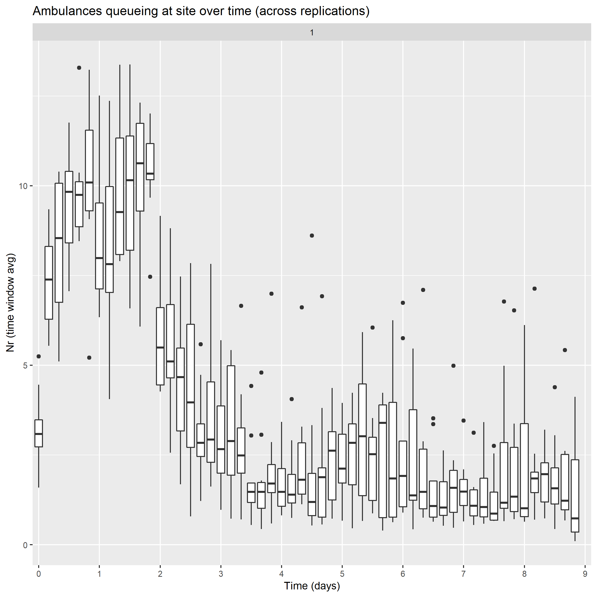

**Not government policy**

 ## Context 

Ambulance handover problems have been dominating the Urgent & Emergency Care (UEC) space. There are currently large handover delays, with a lot of people waiting a long time to be admitted into the emergency department (ED). 

### Understanding, addressing the problem

When a call is made, availability to respond to it depends namely on the number of on-duty ambulance fleet, the on-duty workforce but also the instantaneous availability to be allocated to that incoming call. This in turn depends on when on-duty ambulances can be cleared from previous jobs (finish their job cycle time from allocation to clearance). Handover delays are leading to more ambulances queueing at the hospital site and an increase in job cycle time, which affects their availability for subsequent jobs.

Much of it may not be in the sole direct gift of the ambulance service, as ability to handover depends on A&E availability for clinical handover, which may in turn be affected by, successively: A&E occupancy, bed availability in admitted patient care, inpatient discharge (to home, social care, …).
It is useful though to better understand the ambulance setting and how different factors affect performance. Namely, the relation between handover delays and response times, the impact of resourcing models, changes to job cycle time or fluctuations in demand.

## Problem Statement for discrete event simulation

In the context of ambulance to emergency department handover delays and elevated ambulance response times, build a prototype discrete event simulation model (DES) for the ambulance setting to help understand the potential impacts of:
* resourcing interventions
* factors such as demand, job cycle time components, vehicle capacity

on:
* ambulances queueing at hospital site
* calls queued
* call response times.

An overview of the response time problem restated as a queue is given below. Queues for ambulances to handover at the site can also emerge.

## Implementation

We use R `simmer` to formulate the problem as a set of queues / discreve event simulation.

The main model can be run from `MAIN_simmer_v08.R`. This sets parameters, a wrapper on the core function (for multiple replications), scenarios and does post-processing for dataframes and plots.
This calls on `01-packages.R` to load the packages and `03-replication_v08.R` for the core function defining environment, trajectory and run.

`08-process-viz.R` leverages the `bupaR` package for some process mining and visualisation, leveraging outputted event logs from the main model.

An example process map (showing median times) can be seen below. An animated version can be found by clicking on the image or [here](https://mbfons.github.io/ambulance-DES/Output/20221103_A_ppt/map-absolute_crep1id5_2022-11-09_self.html).

## Example outputs

Example outputs are show below.

Setup A2 considers a stylistic hospital, where demand is of 180 calls per day and 23 vehicles are available. Realistic job cycle time components are set (mostly fixed, but with handover time following a lognormal distribution). All parameters and script can be found in [MAIN_simmer_v08_EXAMPLEpresets-20221103_A_ppt.R](MAIN_simmer_v08_EXAMPLEpresets-20221103_A_ppt.R).

Setup B assumes similar settings but includes a hypothetical intervention where staff of an ambulance (2 staff members) could be reassigned to the hospital site to support with handover bays (3 bays per staff), on a shift by shift basis (1 ambulance : 6 site bays). It is assumed that this can reduce ambulance handover time by 90%, subject to bay availability. All parameters and script can be found in [MAIN_simmer_v08_EXAMPLEpresets-20221103_trigger.R](MAIN_simmer_v08_EXAMPLEpresets-20221103_trigger.R).

* Redeployment from ambulance to bays is dynamically triggered if ambulance site queues exceed a given threshold.
* Redeployment from bays to ambulance is dynamically triggered if the above threshold is not reached AND bays are being underutilised AND call queues exceed a given threshold.

### Setup A2

### Setup B

## License

Distributed under the MIT License. _See [LICENSE](./LICENSE) for more information._

## Contact

If you have any  questions please contact **[Martina Fonseca](mailto:stephen.richer@nhs.net)**.
